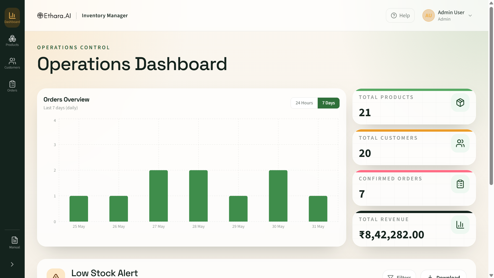
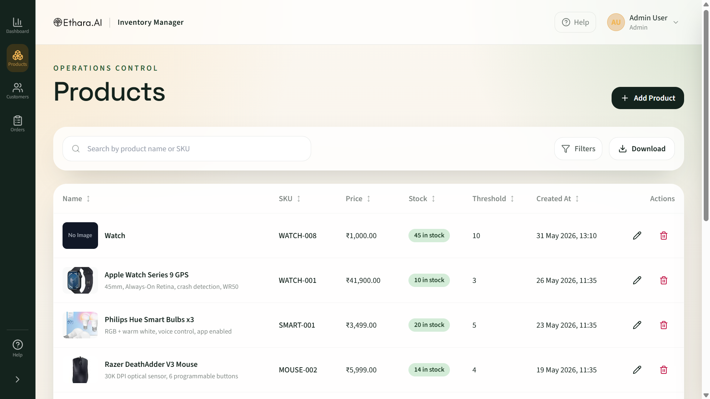
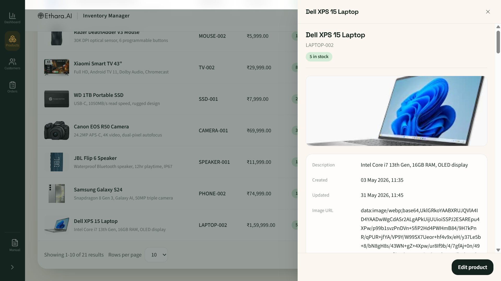
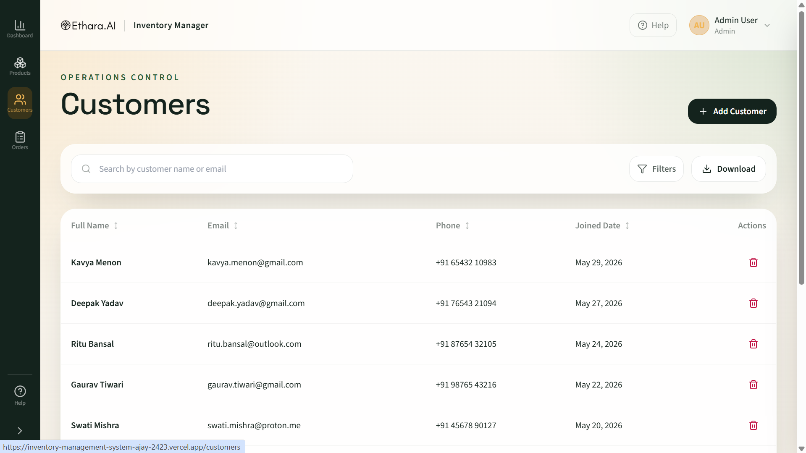
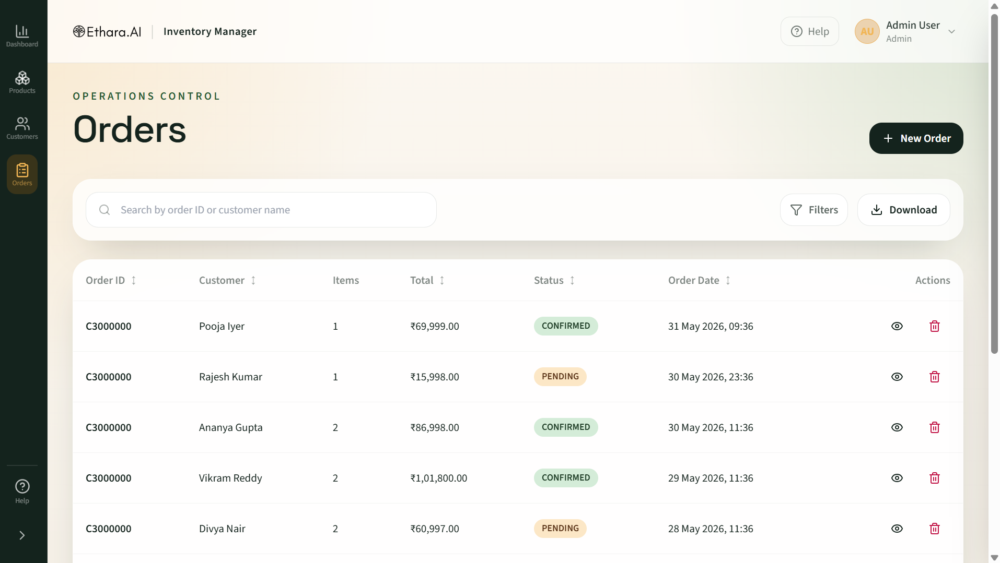
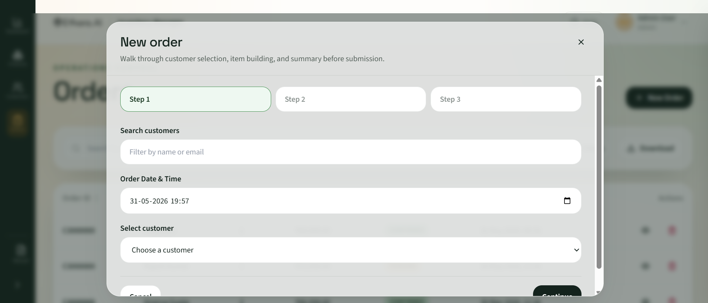
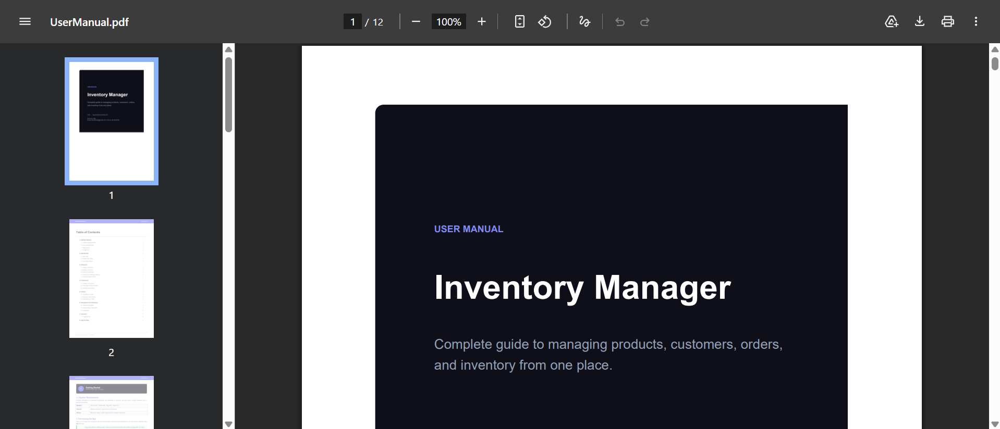

# Inventory Manager


A production-ready full-stack **Inventory & Order Management System** built with **React**, **FastAPI**, **PostgreSQL**, and **Docker**.

Inventory Manager provides a centralized platform to manage products, customers, inventory, and orders while maintaining accurate stock levels, business insights, and real-time operational visibility.

---

# Live Demo

| Service                   | URL                                                                   |
| ------------------------- | --------------------------------------------------------------------- |
| Frontend                  | https://inventory-management-system-eight-wheat.vercel.app/           |
| Backend API Documentation | https://inventorymanagementsystem-production-6a85.up.railway.app/docs |
| Docker Hub Image          | https://hub.docker.com/r/ajay2423/inventory-backend                   |

### Quick Access

**Live Application**

https://inventory-management-system-eight-wheat.vercel.app/

**Backend Swagger Documentation**

https://inventorymanagementsystem-production-6a85.up.railway.app/docs

**Docker Image**

https://hub.docker.com/r/ajay2423/inventory-backend

---

# Features

## Dashboard

* KPI cards for:

  * Total Products
  * Total Customers
  * Confirmed Orders
  * Total Revenue
* Orders Overview Bar Chart

  * Last 24 Hours
  * Last 7 Days
* Low Stock Alert Table
* Product Restock Shortcuts
* Business Insights Dashboard

---

## Products

* Create Products
* Edit Products
* Delete Products
* Unique SKU Validation
* Product Image Support
* Product Detail Drawer
* Product Insights
* Product Search
* Sorting
* Column Filtering
* Pagination
* CSV Export
* Product-specific Low Stock Thresholds

### Product Insights

* Last Ordered Date
* Total Orders Count
* Total Quantity Sold
* Revenue Generated
* Recent Orders History

---

## Customers

* Create Customers
* Delete Customers
* Unique Email Validation
* Customer Detail Drawer
* Customer Insights
* Recent Order History
* Search
* Sorting
* Column Filtering
* Pagination
* CSV Export

### Customer Insights

* Total Orders
* Total Amount Spent
* Last Order Date
* Recent Customer Activity

---

## Orders

* Create Orders
* Order Date & Time Selection
* Automatic Stock Deduction
* Atomic Transactions
* Backend Calculated Totals
* Order Cancellation
* Stock Restoration
* Quick View Drawer
* Full Order Details Page
* Search
* Sorting
* Filtering
* Pagination
* CSV Export

### Order Status Workflow

```text
PENDING
   ↓
CONFIRMED
   ↓
CANCELLED
```

---

## User Experience

* Responsive Design
* Desktop & Mobile Support
* Collapsible Sidebar
* User Manual PDF Integration
* Help Center
* Toast Notifications
* Loading States
* Form Validation
* Error Handling
* Detail Drawers
* Interactive Dashboard

---

# Screenshots

## Dashboard



## Products



## Product Details



## Customers



## Orders



## Create Order



## User Manual



---

# Architecture

```text
┌─────────────────────────────┐
│      React + Vite UI        │
│                             │
│  Dashboard                  │
│  Products                   │
│  Customers                  │
│  Orders                     │
│  User Manual                │
└─────────────┬───────────────┘
              │ HTTP / JSON
              ▼
┌─────────────────────────────┐
│       FastAPI Backend       │
│                             │
│  Products API              │
│  Customers API             │
│  Orders API                │
│  Dashboard API             │
│  Insights API              │
└─────────────┬───────────────┘
              │ SQLAlchemy ORM
              ▼
┌─────────────────────────────┐
│      PostgreSQL 15+         │
│     Persistent Storage      │
└─────────────────────────────┘

              ▲
              │
      Docker Compose
              │
              ▼
     Full Stack Deployment
```

---

# Technology Stack

## Frontend

* React 18
* Vite
* Tailwind CSS
* React Router
* Axios
* Lucide React
* Recharts
* React Hot Toast

## Backend

* FastAPI
* SQLAlchemy
* Pydantic
* Alembic
* PostgreSQL
* Uvicorn

## DevOps

* Docker
* Docker Compose
* Nginx
* Railway
* Vercel
* Docker Hub

---

# Project Structure

```text
inventory-management/
├── backend/
│   ├── alembic/
│   ├── app/
│   │   ├── __init__.py
│   │   ├── database.py
│   │   ├── errors.py
│   │   ├── main.py
│   │   ├── models.py
│   │   ├── routers/
│   │   └── schemas.py
│   ├── Dockerfile
│   ├── requirements.txt
│   └── alembic.ini
│
├── frontend/
│   ├── public/
│   │   └── UserManual.pdf
│   ├── src/
│   │   ├── components/
│   │   ├── pages/
│   │   ├── services/
│   │   ├── App.jsx
│   │   ├── main.jsx
│   │   └── index.css
│   ├── Dockerfile
│   ├── nginx.conf
│   └── package.json
│
├── docs/
│   ├── dashboard.png
│   ├── products.png
│   ├── product-details.png
│   ├── customers.png
│   ├── orders.png
│   ├── create-order.png
│   └── user-manual.png
│
├── docker-compose.yml
├── docker-compose.prod.yml
├── .env.example
└── README.md
```

---

# User Manual

The application includes a built-in User Manual accessible directly from the left sidebar.

Topics covered:

* Dashboard Overview
* Products Management
* Customer Management
* Order Workflows
* Sorting & Filtering
* CSV Export
* Pagination
* Frequently Asked Questions

---

# Getting Started

## Prerequisites

* Docker Desktop or Docker Engine
* Docker Compose
* Node.js 20+
* Python 3.11+
* PostgreSQL 15+ (optional)

---

## Local Development (Docker)

```bash
git clone https://github.com/<your-username>/inventory-management.git

cd inventory-management

cp .env.example .env

docker compose up --build
```

### Application URLs

| Service      | URL                          |
| ------------ | ---------------------------- |
| Frontend     | http://localhost             |
| Backend      | http://localhost:8000        |
| Health Check | http://localhost:8000/health |

---

# API Documentation

## Health Check

```bash
curl http://localhost:8000/health
```

---

## Products

### Create Product

```bash
curl -X POST http://localhost:8000/api/products \
-H "Content-Type: application/json" \
-d '{
  "name":"Wireless Scanner",
  "sku":"WS-100",
  "price":149.99,
  "quantity":25,
  "low_stock_threshold":10,
  "description":"Warehouse barcode scanner",
  "image_url":"https://example.com/image.jpg"
}'
```

### List Products

```bash
curl http://localhost:8000/api/products
```

### Get Product

```bash
curl http://localhost:8000/api/products/<product_id>
```

### Update Product

```bash
curl -X PUT http://localhost:8000/api/products/<product_id>
```

### Delete Product

```bash
curl -X DELETE http://localhost:8000/api/products/<product_id>
```

### Product Insights

```bash
curl http://localhost:8000/api/products/<product_id>/insights
```

---

## Customers

### Create Customer

```bash
curl -X POST http://localhost:8000/api/customers \
-H "Content-Type: application/json" \
-d '{
  "full_name":"Morgan Lee",
  "email":"morgan@example.com",
  "phone":"+1-555-0132"
}'
```

### List Customers

```bash
curl http://localhost:8000/api/customers
```

### Get Customer

```bash
curl http://localhost:8000/api/customers/<customer_id>
```

### Delete Customer

```bash
curl -X DELETE http://localhost:8000/api/customers/<customer_id>
```

### Customer Insights

```bash
curl http://localhost:8000/api/customers/<customer_id>/insights
```

---

## Orders

### Create Order

```bash
curl -X POST http://localhost:8000/api/orders \
-H "Content-Type: application/json" \
-d '{
  "customer_id":"<customer_id>",
  "order_date":"2026-05-31T14:30:00",
  "items":[
    {
      "product_id":"<product_id>",
      "quantity":2
    }
  ]
}'
```

### List Orders

```bash
curl http://localhost:8000/api/orders
```

### Get Order

```bash
curl http://localhost:8000/api/orders/<order_id>
```

### Cancel Order

```bash
curl -X DELETE http://localhost:8000/api/orders/<order_id>
```

---

## Dashboard

### Dashboard Summary

```bash
curl http://localhost:8000/api/dashboard
```

### Orders Chart

```bash
curl "http://localhost:8000/api/dashboard/orders-chart?period=24h"
```

```bash
curl "http://localhost:8000/api/dashboard/orders-chart?period=7d"
```

---

# Running Without Docker

## Backend

```bash
cd backend

python -m venv .venv

source .venv/bin/activate

pip install -r requirements.txt

uvicorn app.main:app --reload
```

Windows PowerShell:

```powershell
.venv\Scripts\Activate.ps1
```

---

## Frontend

```bash
cd frontend

npm install

npm run dev
```

---

# Docker

## Pull Image

```bash
docker pull ajay2423/inventory-backend
```

## Run Container

```bash
docker run -p 8000:8000 ajay2423/inventory-backend
```

---

# Deployment

## Frontend

Platform: Vercel

https://inventory-management-system-eight-wheat.vercel.app/

---

## Backend

Platform: Railway

https://inventorymanagementsystem-production-6a85.up.railway.app/docs

---

## Docker Registry

Docker Hub

https://hub.docker.com/r/ajay2423/inventory-backend

---

# Environment Variables

| Variable          | Description                  |
| ----------------- | ---------------------------- |
| POSTGRES_USER     | PostgreSQL username          |
| POSTGRES_PASSWORD | PostgreSQL password          |
| POSTGRES_DB       | PostgreSQL database name     |
| DATABASE_URL      | PostgreSQL connection string |
| ALLOWED_ORIGINS   | Allowed CORS origins         |
| VITE_API_URL      | Frontend API URL             |

---

# Key Business Rules

* SKU values must be unique.
* Customer email addresses must be unique.
* Product stock can never go below zero.
* Orders fail when requested quantity exceeds available stock.
* Stock deductions occur atomically.
* Order totals are always calculated server-side.
* Cancelling an order restores inventory.
* Products with historical orders cannot be deleted.
* Low stock alerts are based on product-specific thresholds.

---

# Author

**Ajay**

Assessment Project for **Ethara AI**

Email: [ajaydd2423@gmail.com](mailto:ajaydd2423@gmail.com)

---

# License

This project is provided for assessment and educational purposes.
